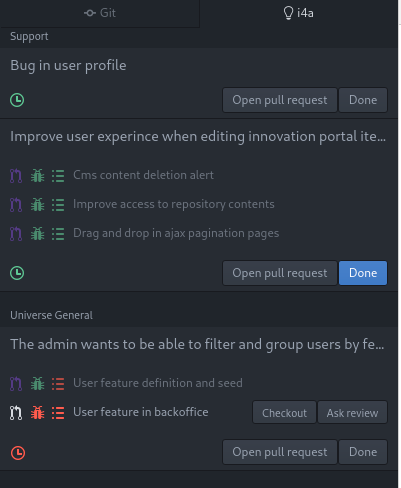

# i4atom package

Support developer workflow and integration among [Trello](https://trello.com/),
[Github](https://github.com/) and [Slack](https://slack.com/)

This package will save you a lot of work if you use Trello cards for a scrum-like
work organization of tasks, but implement the features using Github pull requests and
communicate over Slack




* It shows all your work in progress cards, along all your boards
* It creates pull requests in one click: pushes current branch, creates the pull
  request in Github with a link to the Trello card, and adds a comment in the
  Trello card with a link to the pull request. Documentation tasks made easy!
* It shows a list of all the pull requests in every card with the following information:
  - Pull request revision status and link to the pull request
  - Continuous integration status with a link to the continuous integration url
  - Changelog entry status with a link to the `CHANGELOG.md` file
  - Button for checking out the pull request branch (easy change between cards)
  - Button for asking pull request review in Slack
* Besides the open pull request button, there are buttons for adding time information
  to the card (for time tracking), and a button for moving the card to the testing
  list

## Installation

```
apm install git@github.com:i4a/i4atom
```

## Configuration

You must provide [i4atom](https://github.com/i4a/i4atom) with a Trello key and token, and a Slack webhook.
Besides, you need to activate the Github tab.

The package will lead you to setting them from its configuration section.

## Trello conventions

### List names

[i4atom](https://github.com/i4a/i4atom) will look for a list in each board with the name `✏️ In Progress`. The `Done` button moves cards to a list with the name `🐛 Testing`


### Pull request detection

[i4atom](https://github.com/i4a/i4atom) looks for a string in the form of `PR: <url>` in the comments of each Trello card.

## Development

You can make atom use a local copy of the repository with

1. Remove `i4atom` if it is already installed

```
apm rm i4atom
```

2. Clone [this repository](https://github.com/i4a/i4atom)

```
git clone git@github.com:i4a/i4atom.git
```

3. Go to your local atom packages folder

```
cd ~/.atom/packages
```

4. Link the package

```
ln -s <path/to/cloned/i4atom>
```

5. Restart atom

### JSHint

Install the [JSHint](https://atom.io/packages/jshint) package for linting support


## Acknowledgments

This package has been developed by [ideas4all Innovation](https://www.ideas4allinnovation.com/), in the investment time for personal side projects.

[](https://www.ideas4allinnovation.com/)


Copyright © 2020 Global ideas4all SL
